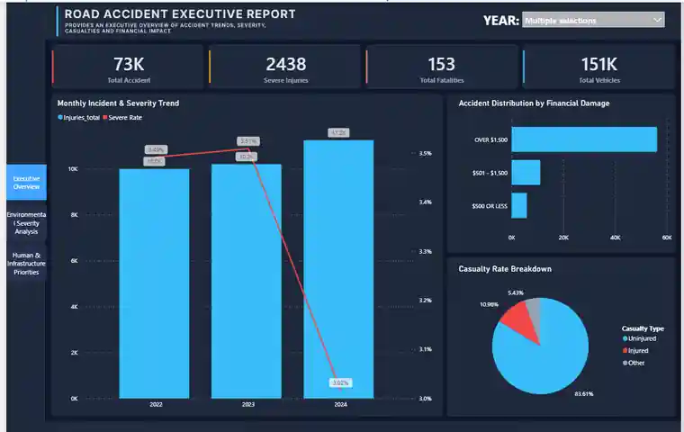
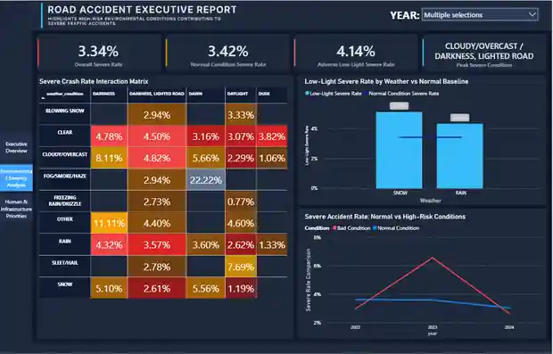
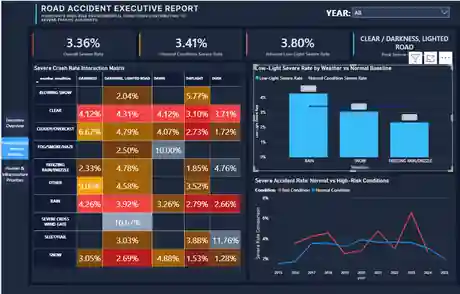
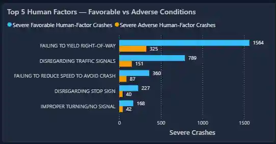
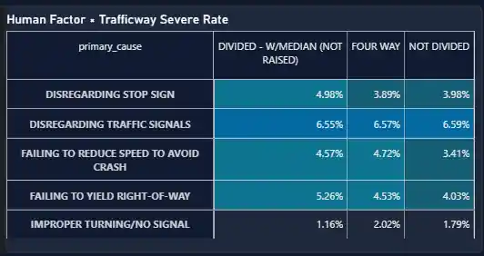
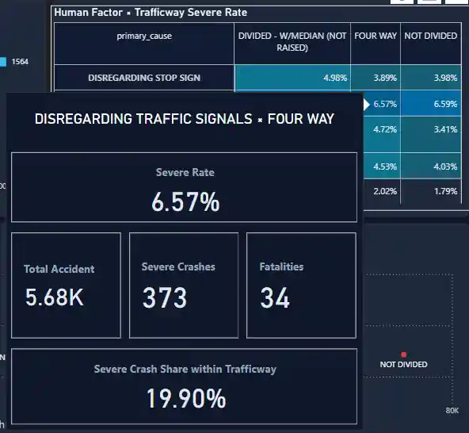
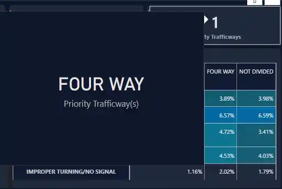
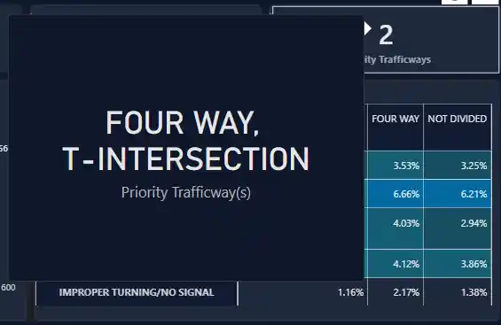

# Traffic Accident Analysis — Power BI

This README focuses on the analytical layer of the Power BI dashboard: the business questions, evidence, findings, and high-level recommendations.  
For the data warehouse architecture, dbt models, and transformation logic, see the project-level README.

> **Interactive dashboard:** _Power BI public link will be added after publishing._

*Figure 1. Human & Infrastructure Priorities dashboard preview.*

---

## 1. Business Questions

- **BQ1 — Environmental Severity Comparison**  
  How does Severe Rate differ between **Adverse Low-Light** and **Normal Conditions**?

- **BQ2 — Environmental Risk Combination**  
  Which sufficiently supported **Weather × Lighting** combinations show the highest Severe Rate?

- **BQ3 — Human Factors under Favorable Conditions**  
  Which driver behaviors remain the most prominent causes of severe crashes under favorable environmental conditions?

- **BQ4 — Infrastructure Prioritization**  
  Which trafficway types should be prioritized when crash frequency and crash severity are considered together?

---

## 2. Analysis Structure

The report is organized into three analytical layers:

### Executive Overview

Provides the overall context for crash volume and severity through:

- Total Accidents
- Total Injuries
- Severe Injuries
- Fatalities
- Total Vehicles
- Severe Rate
- Casualty distribution

The purpose of this page is to separate **crash volume** from **crash severity** rather than assuming that periods with more injuries are also the most severe.

### Environmental Severity Analysis

Addresses **BQ1–BQ2** through:

- Normal vs Adverse Low-Light Severe Rate
- Weather-specific low-light comparison
- Severe Rate trend by period
- Weather × Lighting heatmap
- Crash-volume support buckets
- Peak Severe Condition

### Human & Infrastructure Priorities

Addresses **BQ3–BQ4** through:

- Top Human Factors under Favorable vs Adverse conditions
- Human Factor × Trafficway Severe Rate heatmap
- Supporting contextual tooltips
- Infrastructure Frequency × Severity matrix
- Priority Trafficways
- Priority Severe Crash Share

---

## 3. Findings

### 3.1 Injury volume and crash severity do not necessarily move together

During 2022–2024, injury volume increased while Severe Rate did not move in the same direction.

**Evidence**

- Total Injuries:
  - 2022: ~10.0K
  - 2023: ~10.2K
  - 2024: ~11.2K
- Severe Rate:
  - 2022: 3.49%
  - 2023: 3.51%
  - 2024: 3.02%

2024 recorded the highest injury volume among the three years but the lowest Severe Rate.

*Figure 2. Executive Overview for 2022–2024, highlighting the divergence between injury volume and Severe Rate.*

**Interpretation**

Crash volume and crash severity represent different dimensions of road-safety performance. Volume metrics alone can therefore provide an incomplete picture of crash severity.

---

### 3.2 BQ1 — Adverse low-light conditions show higher aggregate severity, but the pattern is not consistent over time

At the aggregate level, Adverse Low-Light conditions show a higher Severe Rate than Normal Conditions, but this difference is not consistent across individual years.

**Evidence**

For 2022–2024:

- Normal Condition Severe Rate: **3.42%**
- Adverse Low-Light Severe Rate: **4.14%**
- Difference: **+0.72 percentage points**

The yearly comparison shows that 2023 produced the clearest gap, while 2022 and 2024 did not show the same pattern.

Not every adverse weather condition under darkness exceeded the Normal baseline. In the full-period view:

- RAIN: **4.26%**
- SNOW: **3.05%**
- FREEZING RAIN/DRIZZLE: **2.33%**
- Normal baseline: approximately **3.41%**

*Figure 3. Normal and Adverse Low-Light Severe Rates with period comparison.*

**Interpretation**

Adverse low-light conditions are associated with higher severity at the aggregate level, but the pattern depends on period and weather condition. They should not be treated as one uniform risk profile.

---

### 3.3 BQ2 — The highest-severity environmental condition is period-dependent and must be interpreted together with crash volume

The Weather × Lighting combination with the highest supported Severe Rate changes with the analysis period.

**Evidence**

Peak supported condition:

- **Full period:** CLEAR × DARKNESS, LIGHTED ROAD
- **2022–2024:** CLOUDY/OVERCAST × DARKNESS, LIGHTED ROAD

The heatmap also contains cells with very high Severe Rates but low crash volumes. To avoid prioritizing unstable extremes, environmental combinations are interpreted together with their crash-volume support.

*Figure 4. Severe Rate interaction matrix with crash-volume support context.*

**Interpretation**

The highest Severe Rate is not automatically the most decision-relevant condition. Environmental prioritization should consider:

**Severity + Crash Volume + Period Context**

rather than a rate in isolation.

---

### 3.4 BQ3 — High-burden and high-severity human factors are not necessarily the same

Human Factors that dominate **severe-crash burden** are not always the same behaviors that stand out in **severity intensity**.

#### Severe-crash burden

Under Favorable Conditions, **Failing to Yield Right-of-Way** produces the largest severe-crash burden.

Full period:

- Failing to Yield Right-of-Way: **1,564 severe crashes**
- Disregarding Traffic Signals: **789 severe crashes**

2022–2024:

- Failing to Yield Right-of-Way: **564 severe crashes**
- Disregarding Traffic Signals: **299 severe crashes**

Failing to Yield remains the leading severe-crash category in both analysis scopes.

*Figure 5. Severe-crash burden across the leading Human Factors under Favorable and Adverse conditions.*

#### Severity intensity across major trafficways

The Human Factor × Trafficway deep-dive shows that **Disregarding Traffic Signals** has a high and relatively stable Severe Rate across the three major trafficway types included in the heatmap.

Full period:

- DIVIDED - W/MEDIAN (NOT RAISED): **6.55%**
- FOUR WAY: **6.57%**
- NOT DIVIDED: **6.59%**

Supporting evidence:

| Trafficway | Total Accidents | Severe Crashes | Fatalities | Severe Crash Share within Trafficway |
|---|---:|---:|---:|---:|
| DIVIDED - W/MEDIAN (NOT RAISED) | ~2.02K | 132 | 14 | 11.95% |
| FOUR WAY | ~5.68K | 373 | 34 | 19.90% |
| NOT DIVIDED | ~3.81K | 251 | 20 | 11.29% |

For 2022–2024, the pattern remains elevated:

- FOUR WAY × Disregarding Traffic Signals: **6.66%**
- NOT DIVIDED × Disregarding Traffic Signals: **6.21%**

*Figure 6. Severe Rate across leading Human Factors and major trafficway types.*

*Figure 7. Representative deep-dive tooltip showing Severe Rate, crash volume, severe crashes, fatalities, and Severe Crash Share within FOUR WAY.*

**Interpretation**

Two behavioral dimensions should be distinguished:

- **Failing to Yield Right-of-Way** stands out by severe-crash burden.
- **Disregarding Traffic Signals** stands out by severity intensity across major trafficway contexts.

Behavioral prioritization should therefore consider both count-based burden and severity rate rather than relying on one ranking alone.

---

### 3.5 BQ4 — Severe-crash priority is concentrated in a small set of trafficway types and cannot be inferred from crash frequency alone

The trafficway type with the highest accident volume is not necessarily the highest priority once severity is considered.

#### Full period

- Priority Trafficways: **1**
- Priority Trafficway: **FOUR WAY**
- Priority Severe Crash Share: **27.71%**

NOT DIVIDED has high crash frequency but does not simultaneously exceed both the frequency and Severity Index thresholds.

*Figure 8. Full-period view with FOUR WAY identified as the Priority Trafficway.*

#### 2022–2024

- Priority Trafficways: **2**
- Priority Trafficways:
  - FOUR WAY
  - T-INTERSECTION
- Priority Severe Crash Share: **50.45%**

These two trafficway categories contain approximately half of the severe crashes in the selected period.

FOUR WAY also retains a notable behavioral pattern for Disregarding Traffic Signals:

- Full-period Severe Rate: **6.57%**
- Full-period Severe Crash Share within FOUR WAY: **19.90%**
- 2022–2024 Severe Rate: **6.66%**
- 2022–2024 Severe Crash Share within FOUR WAY: **19.81%**

*Figure 9. 2022–2024 view with FOUR WAY and T-INTERSECTION identified as Priority Trafficways.*

**Interpretation**

Crash frequency alone is insufficient for infrastructure prioritization. Combining:

**Crash Frequency + Severity Index**

helps identify trafficway categories that combine substantial crash burden with elevated severity.

---

## 4. Recommended Actions

### 4.1 Monitor environmental severity by period

Monitor Adverse Low-Light severity by period rather than assuming that adverse conditions have a uniform effect across all years.

Prioritize combinations that show:

- elevated Severe Rate relative to baseline,
- sufficient crash volume,
- and recurring or persistent patterns across relevant periods.

### 4.2 Combine severity with crash volume when prioritizing environmental conditions

Do not use the highest Severe Rate as a standalone priority criterion.

Environmental conditions should be assessed using:

- Severe Rate,
- crash volume,
- volume-support level,
- and selected analysis period.

This reduces the risk of over-prioritizing extreme rates based on very small samples.

### 4.3 Separate high-burden and high-severity behavioral priorities

Behavioral monitoring should distinguish between:

- **High-burden behaviors** — behaviors associated with many severe crashes.
- **High-severity behaviors** — behaviors showing elevated Severe Rates within relevant trafficway contexts.

Based on the current analysis:

- Failing to Yield Right-of-Way is a key high-burden behavioral group.
- Disregarding Traffic Signals is a key high-severity behavioral group.

These groups should receive priority in subsequent analysis rather than being collapsed into a single behavioral ranking.

### 4.4 Prioritize infrastructure using both crash frequency and severity

Trafficway prioritization should continue to combine:

- crash frequency,
- and Severity Index,

instead of relying only on Total Accidents.

The current results highlight:

- FOUR WAY as a consistent priority across the full-period and 2022–2024 analyses.
- T-INTERSECTION as an additional priority in the 2022–2024 slice.
- Priority Trafficways accounting for **50.45%** of severe crashes in the recent-period slice.

These categories provide a focused starting point for further safety review and analysis.

---

## 5. Limitations

- **Severe Rate measures severity among recorded crashes**, not crash probability or population-level road risk.
- The dataset does not include complete exposure measures such as traffic volume, vehicle miles travelled, or the number of road users.
- High Severe Rates in low-volume groups may be unstable; crash-volume context is therefore used to interpret extreme values.
- `trafficway_type` is a broad infrastructure category and does not identify a specific road location or intersection.
- Human Factor × Trafficway findings describe associations and concentration within recorded crashes; they do not establish causal relationships.
- Favorable and Adverse severe-crash counts reflect the size and composition of each crash population. Higher counts do not by themselves imply greater risk without an exposure denominator.
- Comparisons between the full period and 2022–2024 represent different analytical scopes and should not automatically be interpreted as a temporal trend unless data completeness by period is confirmed.

---

## Analysis Summary

The analysis shows that road-safety prioritization should not rely on a single metric.

Environmental severity varies with condition, crash volume, and period. Behavioral analysis shows that high-burden and high-severity behaviors can differ. Infrastructure analysis also shows that the highest-frequency trafficway is not necessarily the highest priority once severity is considered.

The dashboard therefore follows a simple analytical framework:

**Volume → Severity → Context → Prioritization**

to identify environmental conditions, Human Factors, and trafficway types that warrant further analytical attention.
