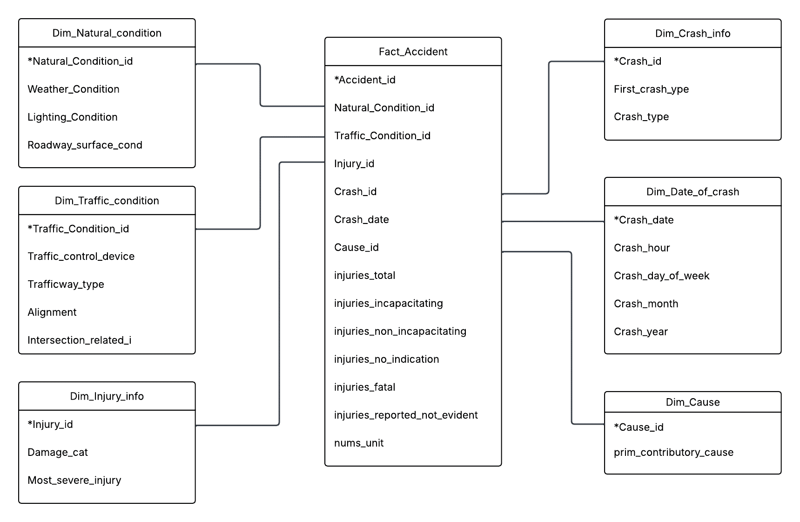

# 🚦 Kho dữ liệu và Phân tích Tai nạn Giao thông (Traffic Accident DWH)

## 📌 Giới thiệu dự án

Dự án này là Đồ án môn học **Kho dữ liệu và OLAP**, tập trung vào việc xây dựng một hệ thống Kho dữ liệu (Data Warehouse) hoàn chỉnh để phân tích các vụ tai nạn giao thông. Mục tiêu cốt lõi là chuyển đổi dữ liệu thô từ các hệ thống nguồn sang mô hình Star Schema, từ đó cung cấp khả năng truy vấn đa chiều và trực quan hóa các chỉ số quan trọng về an toàn giao thông.

## 🛠 Tech Stack & Kiến trúc Hệ thống

Hệ thống sử dụng luồng xử lý ELT (Extract - Load - Transform) tối ưu hóa hiệu suất trên SQL Server:

- **Tiền xử lý (Data Preprocessing):** Python (Pandas) thực hiện làm sạch và chuẩn hóa dữ liệu từ file CSV.
- **Tích hợp dữ liệu (ETL):** **SSIS** (SQL Server Integration Services) điều phối luồng dữ liệu từ nguồn vào Data Warehouse.
- **Mô hình hóa đa chiều (OLAP):** **SSAS** (SQL Server Analysis Services) xây dựng khối Cube, định nghĩa các Measure và Dimension.
- **Truy vấn phân tích:** T-SQL (Chuyển đổi logic từ MDX sang SQL để đảm bảo tính nhất quán và hiệu suất truy vấn).
- **Trực quan hóa:** Power BI (Kết nối trực tiếp vào các SQL View để xây dựng Dashboard).

## 🗄 Mô hình Dữ liệu (Star Schema)



Hệ thống được thiết kế theo mô hình hình sao (Star Schema) chuẩn, bao gồm:

- **Bảng Fact:** `Fact_Accident` (Chứa các metrics về thương vong, số người chết, bị thương và số phương tiện).
- **6 Bảng Dimension:**
  - `Dim_Date_of_crash`: Thứ, ngày, tháng, năm và khung giờ xảy ra tai nạn.
  - `Dim_Natural_condition`: Các yếu tố môi trường (Thời tiết, ánh sáng, tình trạng mặt đường).
  - `Dim_Traffic_condition`: Đặc điểm hạ tầng (Thiết bị điều khiển giao thông, loại đường, vị trí ngã tư).
  - `Dim_Crash_info`: Phân loại vụ va chạm (Loại va chạm, hình thức va chạm đầu tiên).
  - `Dim_Injury_info`: Phân loại mức độ thiệt hại và chấn thương nghiêm trọng.
  - `Dim_Cause`: Nguyên nhân chủ quan chính dẫn đến vụ tai nạn.

## 📂 Cấu trúc Repository

```text
📦 Traffic-Accident-DWH
┣ 📂 1_Data                 # Chứa dữ liệu gốc (Raw CSV files)
┣ 📂 2_Preprocessing        # Script Python làm sạch dữ liệu
┣ 📂 3_Data_Mining          # Các xử lý khai phá dữ liệu (nếu có)
┣ 📂 4_Database_SQL         # Script DDL khởi tạo Database và cấu trúc bảng
┣ 📂 5_ETL_Pipeline         # Script T-SQL ELT (Bulk Insert, Proc) & SQL Views cho BI
┣ 📂 6_Dashboard_BI         # File Power BI (.pbix) và hình ảnh báo cáo
┗ 📜 README.md              # Tài liệu hướng dẫn dự án
```
