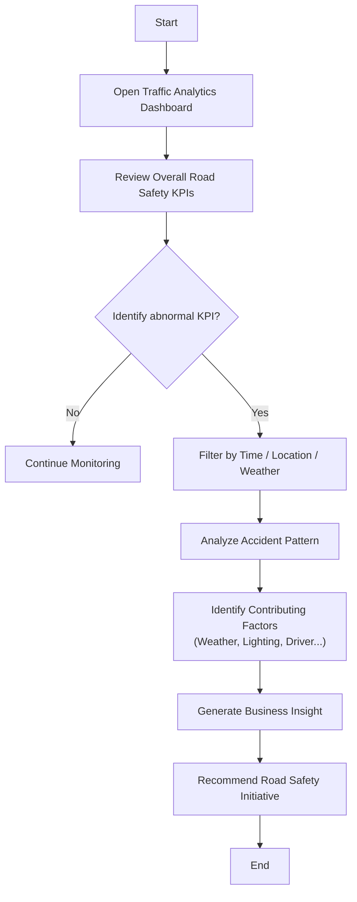

# Traffic Analytics Flow

```mermaid
flowchart TD
    A[Start] --> B[Open Traffic Analytics Dashboard]
    B --> C[Review Overall Road Safety KPIs]
    C --> D{Identify abnormal KPI?}
    D -- No --> E[Continue Monitoring]
    D -- Yes --> F[Filter by Time / Location / Weather]
    F --> G[Analyze Accident Pattern]
    G --> H["Identify Contributing Factors<br/>(Weather, Lighting, Driver...)"]
    H --> I[Generate Business Insight]
    I --> J[Recommend Road Safety Initiative]
    J --> K[End]
```
